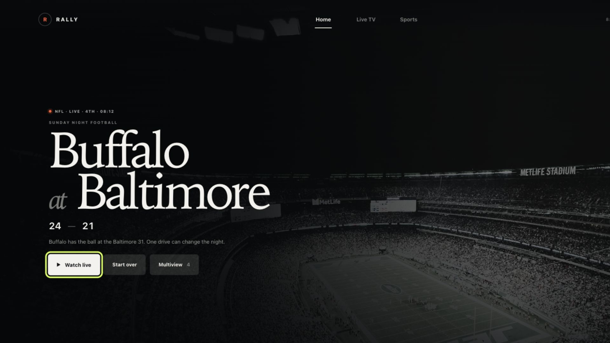
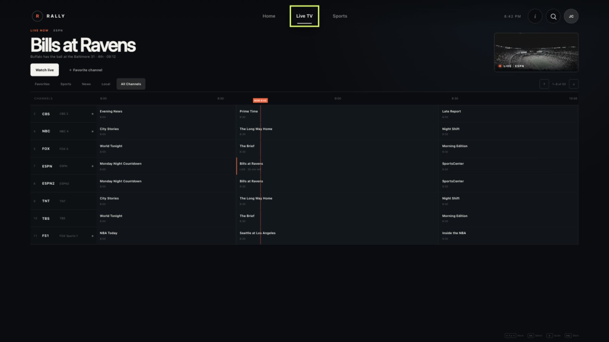
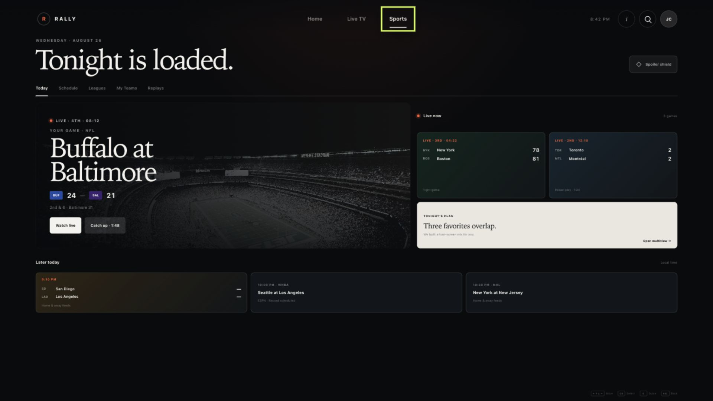
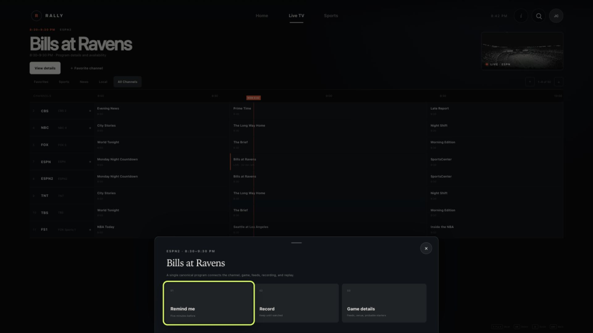
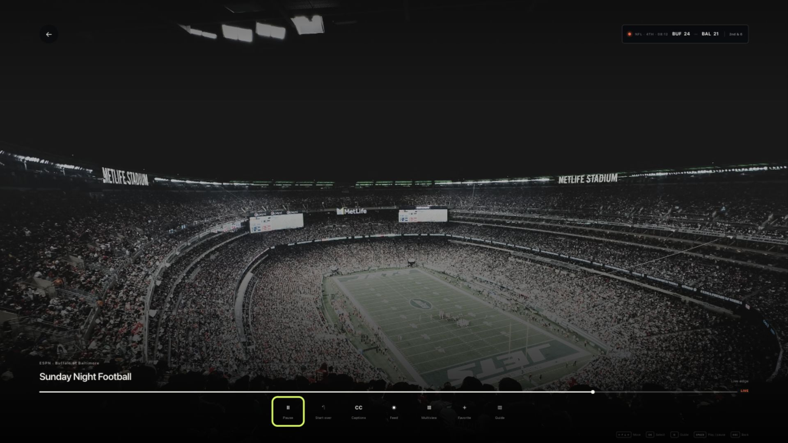
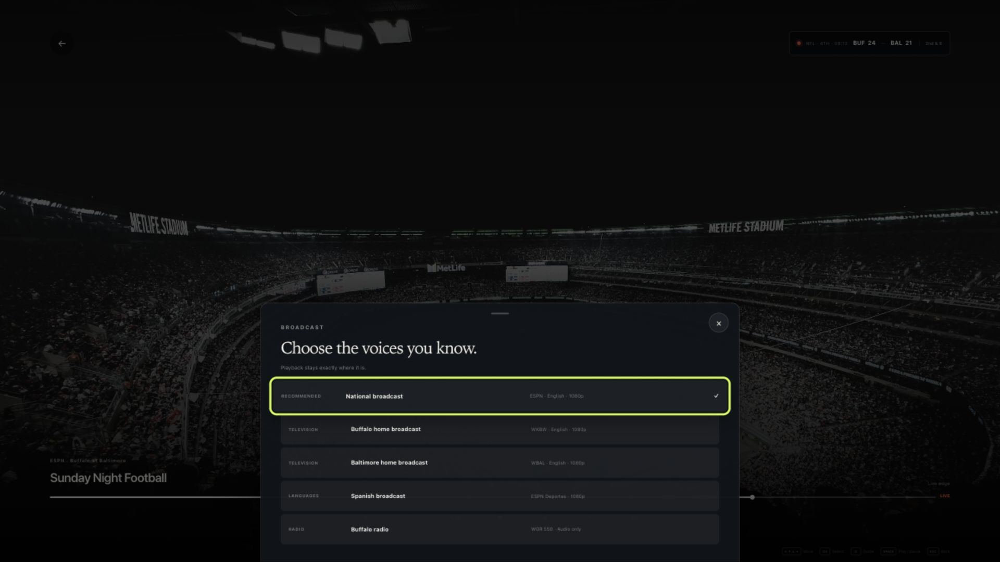
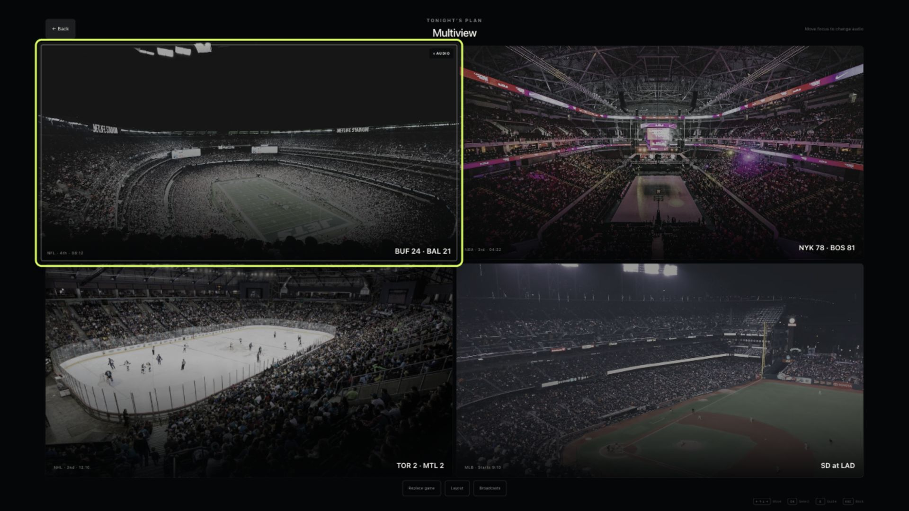
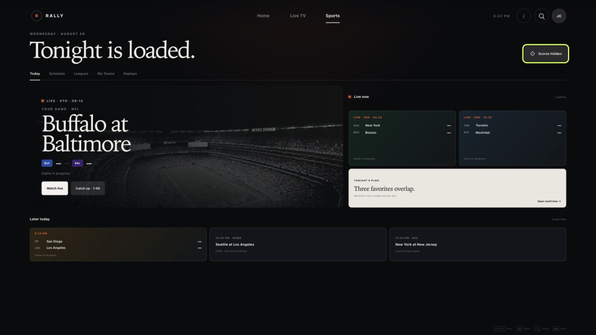

# RALLY — Live TV, alive.

## The concept

RALLY is a television experience designed around a simple premise: live viewing should feel alive.

The product brings together two systems that are usually fragmented:

- A traditional live TV service with roughly 50 channels and program-guide data
- A league-pass-style sports product spanning NFL, MLB, NBA, and NHL references, including alternate broadcasts and simultaneous games

The design is intentionally remote-first. Every primary task is possible with four directional inputs, Select, and Back. The interface may be viewed in a browser, but its real frame is a living-room screen viewed from ten feet away.

## The problem

Live TV products often inherit three kinds of friction:

1. **The guide becomes a spreadsheet.** Rows and columns technically expose the schedule but make scanning feel slow and administrative.
2. **Sports rights become the user’s problem.** A single event may appear as a league stream, national broadcast, regional broadcast, radio call, alternate language, replay, or recording.
3. **The interface competes with the thing being watched.** Persistent rails, dense metadata, and catalog patterns treat video as one tile among many.

RALLY resolves these tensions with one event model, one focus grammar, and a small set of stable surfaces.

## North star

> The game stays on screen. The interface moves around it.

Three principles follow from that sentence:

### Browse cinematically

The home screen presents one dominant live story rather than a wall of interchangeable posters. The score, game state, and moment-aware copy answer “Why now?” before the user has to choose.

### Watch invisibly

Playback remains visually primary. Controls appear along the live edge only when invoked, and temporary decisions—such as choosing a broadcast—arrive as a contained layer over the game.

### Scan exactly

The guide behaves like a timeline instrument. Channel identity, program duration, and the current-time line stay aligned so users can understand what is on now and what follows without decoding a table.

## Information architecture

RALLY has three primary destinations:

- **Home** — the best live moment for the current viewer, followed by a concise “Now & next” plan
- **Live TV** — the channel guide, filters, program actions, and the live preview
- **Sports** — all games organized by state and relevance across leagues

The player and Multiview are immersive destinations rather than permanent navigation tabs. Search and profile preferences are temporary layers.

## One event, many valid ways in

The product model treats channels and games as peers:

```text
CHANNEL                          EVENT
ESPN                             Bills at Ravens
schedule                         score + clock
program                          rights + availability
live stream                      replay + recordings
        \                        /
         \                      /
          ONE WATCH DESTINATION
          best valid feed, resolved
```

A user selecting a game should not need to understand the rights graph. RALLY resolves the best included option and describes it plainly: “Watch live,” “Watch on ESPN,” “Home & away feeds,” or “Replay available.”

## Remote interaction grammar

### Directional focus

Focus moves spatially, not by source order. Each arrow press ranks valid targets in the requested direction, then chooses the nearest candidate while penalizing cross-axis distance. This makes movement feel physically predictable across cards, guide cells, and control rows.

### A universal focus signal

The active target uses a 4 px volt-colored outline with enough offset to remain visible on light, dark, photographic, and translucent surfaces. Color is not the only signal: the focused object also changes scale, contrast, or elevation.

### Stable consequences

- Focus previews; Select commits.
- Merely moving over a channel never tunes it.
- Back reverses one layer at a time.
- Closing a layer restores the prior focus position.
- Scores never reorder the card currently under the user.
- Playback continues behind feed and settings decisions.

### Living-room measurements

- 96 × 60 px safe-area rhythm
- 64 px minimum interactive target
- Approximately 160 ms focus motion
- 4 px universal focus outline
- No essential information at the extreme display edge

## Signature surfaces

### 01 — Live home



The home screen is a live editorial decision. A favorite event becomes the background and headline. The score, clock, possession context, and one-sentence narrative establish urgency. “Now & next” is a plan for the evening, not an infinite carousel.

Design decisions:

- Large serif display type gives the live event the gravity of a broadcast title card.
- High-priority actions sit in one horizontal remote path.
- The default focus is “Watch live.”
- The lower strip mixes current games, upcoming games, and a prebuilt Multiview suggestion.

### 02 — 50-channel guide



The guide shows eight channels at a time, enough for context without shrinking type. Page Up and Page Down move one stable viewport, while filters reduce the guide to Favorites, Sports, News, Local, or all channels.

Design decisions:

- The selected program’s title and actions live above the grid, eliminating cramped detail popovers.
- A pinned preview keeps live video present without allowing it to dominate dense schedule work.
- Width communicates duration.
- A coral NOW line intersects every channel row and aligns with the time ruler.
- Channel number, abbreviated mark, full name, and favorite state remain visible at once.
- Pagination reports both position and total count: “1–8 of 50.”

### 03 — Sports today



Sports Today organizes the night by state rather than league silo. The viewer’s highest-relevance live game receives the feature position; other live games form a compact spine; upcoming games appear chronologically.

Design decisions:

- NFL, NBA, NHL, MLB, and WNBA examples share one card grammar.
- League color changes atmosphere, never navigation.
- Every live card exposes league, state, teams, score, and one decisive contextual note.
- The “Tonight’s plan” card promotes Multiview only when overlap makes it useful.
- Tabs expose Schedule, Leagues, My Teams, and Replays without moving Today’s layout.

### 04 — Program actions



An upcoming program opens a single action layer for reminder, recording, and deeper game details. The guide remains visible behind it, preserving time and channel context.

### 05 — Live player



The player uses the full display. A compact scorebug anchors the event state while controls attach to the live timeline at the bottom.

Design decisions:

- The first focused action is Play/Pause.
- Start over, captions, feed, Multiview, favorite, and guide share a single remote path.
- “Live edge” explains the timeline state without requiring transport-control literacy.
- The controls disappear conceptually when intent ends; the design avoids persistent catalog chrome.

### 06 — Broadcast selector



Alternate feeds are described in human terms: national, Buffalo home, Baltimore home, Spanish, and radio. Technical quality remains secondary metadata. Selecting a new feed preserves playback position.

### 07 — Multiview



Four games share a two-by-two grid. Focus changes the active audio immediately; Select takes that pane full screen. The same volt outline used everywhere else makes the audio source unmistakable.

### 08 — Spoiler Shield



Spoiler protection is a product mode, not a single score toggle. In the concept it neutralizes scores and outcome-aware copy while preserving teams, live state, and navigation. A production system should extend that policy to thumbnails, headlines, progress bars, replay duration, and notifications.

## Delight in the details

### Moment-aware return

When a user returns to an in-progress game, RALLY can offer “Catch up since you left · 0:52.” The promise is specific: become current without watching a generic recap or learning the present score first.

### Broadcast memory

Home commentary, language, caption, and radio preferences follow a team and profile rather than a device. A viewer who prefers the Buffalo call should not repeat that choice every week.

### Rights resolved, not reported

Blocked or duplicated feeds should never terminate in a rights error when another included path exists. RALLY translates availability into an actionable destination.

### A plan for overlapping games

Multiview is recommended when followed teams overlap. The product can preassemble a mix, but it never traps the viewer: every pane is replaceable and full-screen selection is one click away.

## Visual system

### Palette

| Role | Value | Use |
| --- | --- | --- |
| Warm black | `#080A0D` | Base canvas, dense information surfaces |
| Paper | `#F4F2ED` | Primary type and selected light surfaces |
| Signal coral | `#FF5B35` | Live state, current time, urgency |
| Focus volt | `#D6FF4B` | Focus only; never decorative |

### Typography

- A high-contrast editorial serif carries live-event titles and emotional hierarchy.
- A neutral sans serif carries navigation, scores, metadata, and controls.
- Uppercase micro-labels establish rhythm but never hold essential instructions alone.

### Surface logic

- Video and photography remain visible on browse and playback surfaces.
- Dense guide information stays opaque and exact.
- Translucency is reserved for temporary layers over video.
- Borders are quiet; focus is loud.

## Accessibility and resilience

- Every interactive object has an accessible name.
- Focus is visible against every surface and is not encoded by color alone.
- Information hierarchy remains understandable without motion.
- Score hiding preserves team and game-state context.
- Buttons meet living-room target-size expectations.
- The interaction model supports keyboard parity for prototype evaluation.
- A production version should honor reduced-motion, caption, audio-description, contrast, and text-scaling preferences.

## Prototype scope

The interactive concept demonstrates:

- 50 mock channels with filterable EPG data and eight-channel paging
- Home, guide, sports, player, and Multiview destinations
- Spatial keyboard/remote focus
- Live and upcoming program behavior
- NFL, MLB, NBA, NHL, and WNBA reference scenarios
- Feed choice, profile preferences, search, spoiler protection, reminders, and recordings

It intentionally does not include video playback, authentication logic, real schedules, rights enforcement, telemetry, backend services, or production-grade recommendation models.

## What should be tested next

1. Can users reach any channel in the 50-channel guide without losing time context?
2. Do sports viewers understand the distinction between an event and its available broadcasts?
3. Does focus movement remain predictable across guide cells of different widths?
4. Does Spoiler Shield hide enough—not merely scores—to feel trustworthy?
5. Do users prefer an automatically assembled Multiview or a manual builder?
6. What information is essential at ten feet across 1080p and 4K displays?

## Success measures for a production product

- Time from app launch to playing the intended live event
- Guide traversal time and wrong-tune rate
- Frequency of feed-switch abandonment
- Multiview starts and full-screen transitions
- Successful return-to-live behavior after pause or catch-up
- Spoiler-related support complaints or mode disablement
- Remote key presses per completed task

## Concept status

This is a design prototype, not a licensed streaming service. All schedules, scores, and product behavior are static examples created to make the concept realistic. League, team, channel, and broadcaster names and marks belong to their respective owners.

